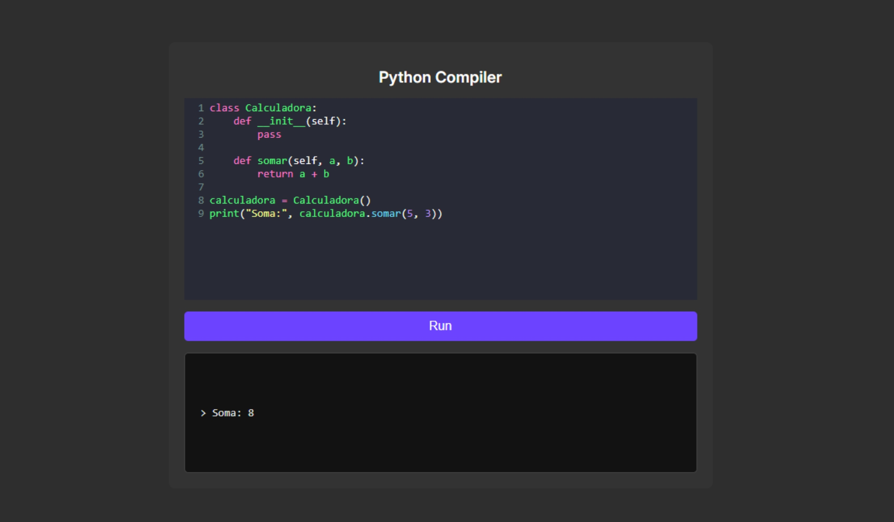

# Compilador Simples de Python

## Sobre o projeto

Um apicativo capaz de compilar códigos simples em python.

## Como utilizar

Digite ou cole seu código Python no editor, logo após basta clucar em Run (Executar) para compilar seu código.

## Informações

Projeto desenvolvido utilizando HTML, CSS e JavaScript. Utilizado também a biblioteca CodeMirror

